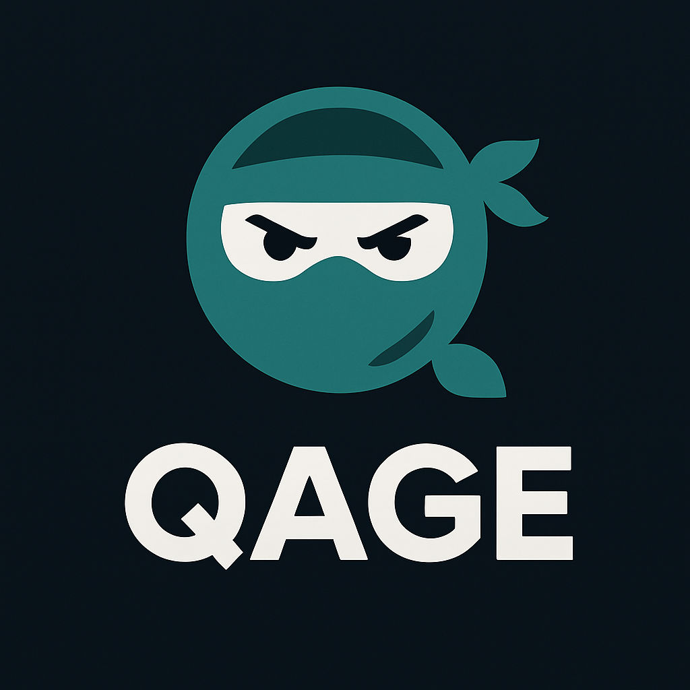

# Qage

*Qage is a groundbreaking AI-powered tool created to transform how businesses approach requirements analysis and test case design. Unlike traditional solutions, Qage is a new and unique product, not yet available on the market, offering a fresh perspective on leveraging artificial intelligence for quality assurance.*

## What is Qage?

*Qage is designed to help organizations bridge the gap between business requirements and software testing. By applying advanced AI and Retrieval-Augmented Generation (RAG) techniques, Qage automatically analyzes business requirements, extracts key information, and generates comprehensive, high-quality test cases. This ensures that critical scenarios are covered and that the quality of software products is continuously improved.*

## Key Value Proposition

- **Innovative and Unique**: Qage is a new tool, not yet available on the market, providing a novel approach to requirements analysis and test case generation.
- **AI-Driven Requirement Analysis**: Automatically interprets and understands business requirements, reducing manual effort and minimizing human error.
- **Automated Test Case Design**: Generates relevant, effective, and comprehensive test cases, ensuring better coverage and higher quality.
- **Knowledge Retention with RAG**: Utilizes Retrieval-Augmented Generation to store and retrieve organizational knowledge, enabling smarter and more complete test case generation over time.
- **Continuous Improvement**: Increases the percentage of test case coverage as more requirements and knowledge are processed, making future testing more robust and efficient.
- **Empowering Quality Assurance**: Helps teams save time, improve software quality, and leverage accumulated knowledge for ongoing success.
- **Scalable and Adaptable**: Suitable for organizations of any size, Qage adapts to evolving business needs and integrates seamlessly into existing workflows.

## Why Choose Qage?

- **Stay Ahead of the Curve**: Be among the first to adopt a next-generation tool that redefines how requirements and testing are managed.
- **Boost Productivity**: Automate tedious and error-prone tasks, freeing up valuable time for your team to focus on innovation.
- **Enhance Test Coverage**: Ensure that your software is thoroughly tested, reducing the risk of missed scenarios and costly bugs.
- **Leverage Organizational Knowledge**: Build a knowledge base that grows with your business, making every test cycle smarter and more effective.

*Qage is the future of intelligent requirements analysis and test case design. Join us on this journey to elevate your quality assurance process and deliver better software, faster.*

